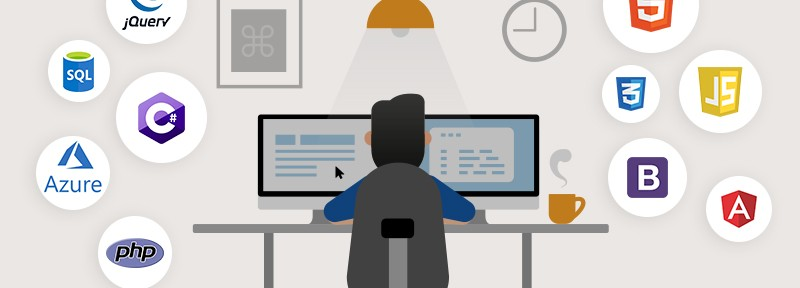

<h3 align="center">👋 Hello! I'm Jagadish.</h3>

  <a href="https://www.kaggle.com/jagadish13">Kaggle</a> •
  <a href="https://twitter.com/JagadishSiva">Twitter</a> •
  <a href="https://www.linkedin.com/in/jagadish-sivakumar/">LinkedIN</a>

---

### Who am I

An innovator by nature, who wants to break the conventional ways of web designing. Exposure to fields like Design to Technology and Psychology changed my views of seeing the world. I love seeing technology in terms of design and interaction. This vision reflects in all of my projects and ideas.

Experimenting and exploring is my way of life. In short, I do what I love and I love what I do.

---

### Portfolio

Currently, I'm the head of MegaCraft Technologies and a freelance web developer who wants to break the conventional ways of web designing. Before that, I was a front-end developer in Start 247, Cavadium Retail, and National Institute of Ocean Technology (NIOT)

---

### Get in touch

*  Personal site:  <a href="http://www.jagadishsivakumar.in/"> https://jagadishsivakumar.in/ </a>  
*  CodePen:  <a href="http://www.jagadishsivakumar.in/"> https://codepen.io/jagadishsivakumar </a>

